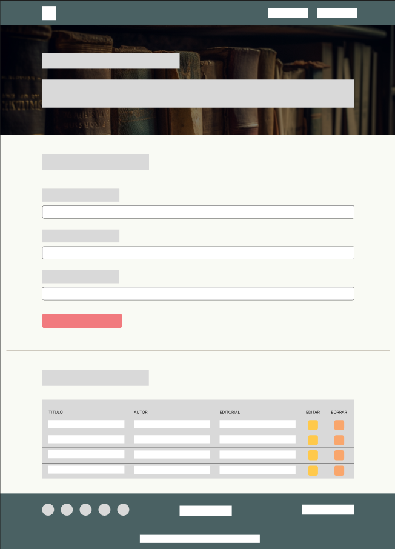
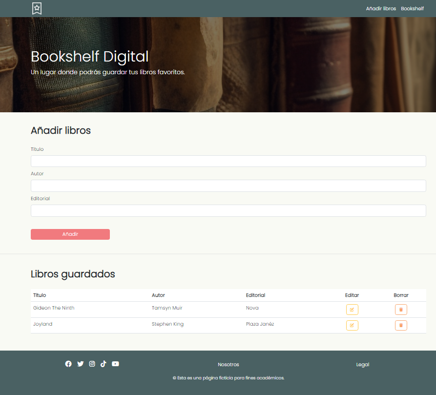
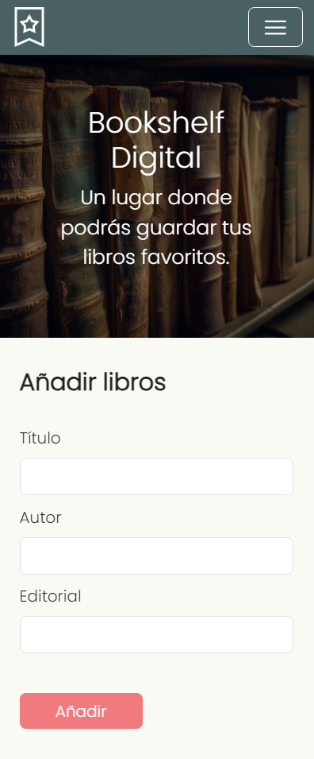

Proyecto 2: Aplicación CRUD
# **Aplicación CRUD: Bookshelf Digital**

## **Descripción:**
Para este proyecto se creó una página para llevar un registro de libros de forma digital, en donde se muestra un formulario para añadir los libros y debajo de este una tabla con los registros.

Como base para el proyecto, se requiere la utilización de operaciones CRUD, las cuales trabajan con datos y los incorporan en la interfaz de usuario para que estos puedan ser leídos, buscados, modificados o borrados, de acuerdo con el acrónimo (Create, Read, Update, Delete).

Primero se realizó un diseño a través de la aplicación figma, el cual se muestra a continuación:

Luego se paso a desarrollar la página utilizando HTML5 semántico y CSS para lograr tanto la versión desktop como mobile.

Finalmente, se incorporan las diferentes funcionalidades de la aplicación a través de JavaScript, utilizando 5 funciones:
1. Función Leer: Se encarga de leer todos los datos guardados.
2. Función Añadir: Permite añadir datos definidos por el usuario.
3. Función Editar: La cual busca los datos que se desean cambiar.
4. Función Actualizar: En donde se guardan los cambios realizados a los datos y muestra su versión actualizada.
5. Función Borrar: Elimina el dato deseado de los registros.

## **Features:**
Para el desarrollo del proyecto se utilizaron diferentes tecnologías, tales como:
- Aplicación Figma: Para el desarrollo del diseño inicial de la página web.
- Bootstrap: Incorporación de variados componentes del framework para agilizar el desarrollo del prototipo y facilitar el Responsive Web Design.
- Fontawesome: Para la incorporación de diferentes íconos.

## **Objetivos:**
El proyecto se enfoca en el desarrollo de una aplicación CRUD, y más específicamente:
1. Aplicar operaciones CRUD en un segmento de datos.  
&emsp; 1.1. Aplicar un formulario para la creación de elementos.  
&emsp; 1.2. Visibilizar los elementos guardados.  
&emsp; 1.3. Poder modificar los elementos guardados.  
&emsp; 1.4. Poder eliminar los elementos guardados.  
2. Estructurar bajo un paradigma de programación.

## **Demo:**
A continuación, se presenta un enlace a la demo del proyecto.

https://ferramirez99.github.io/Proyecto2/